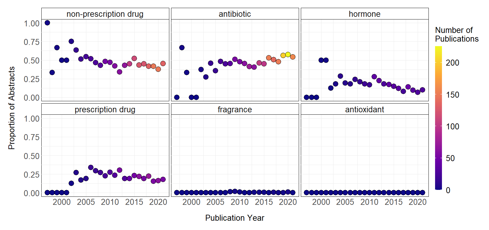
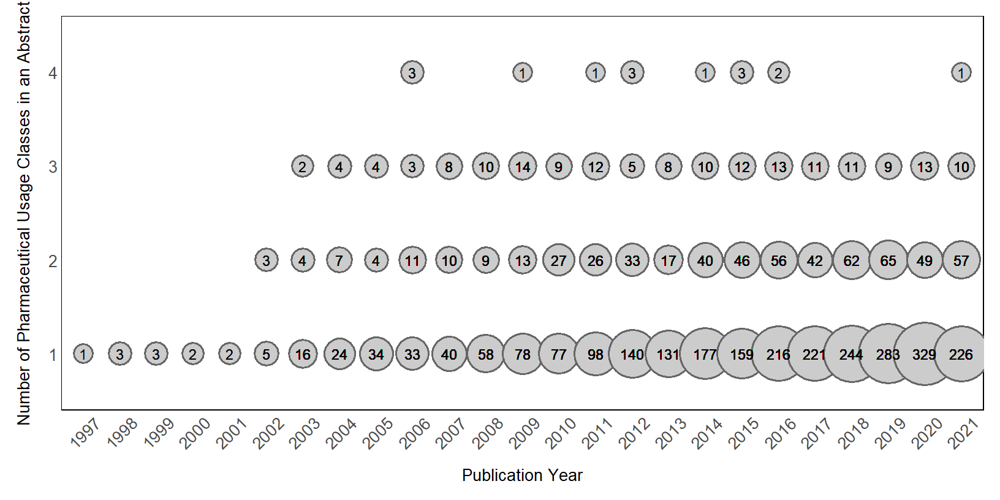
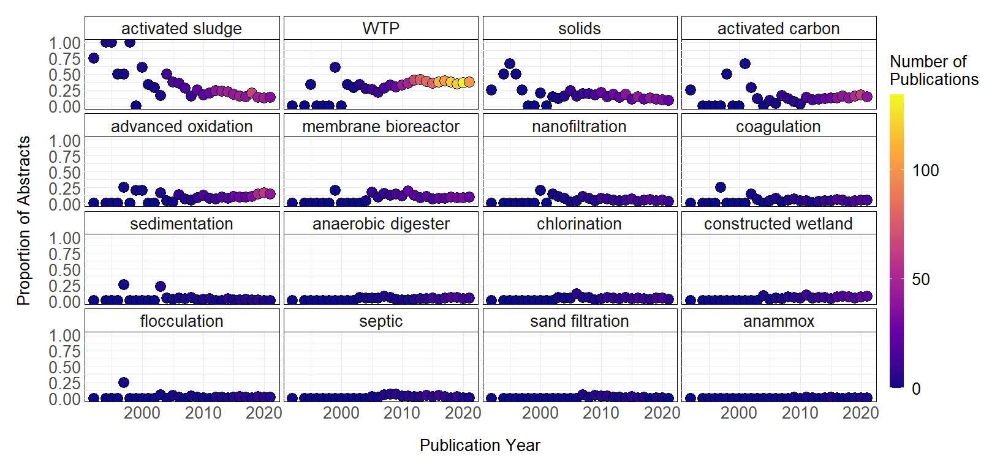
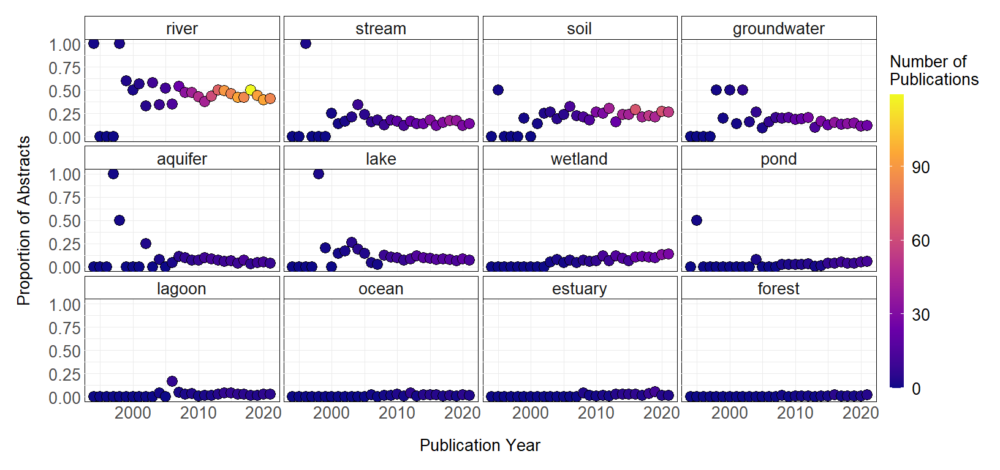
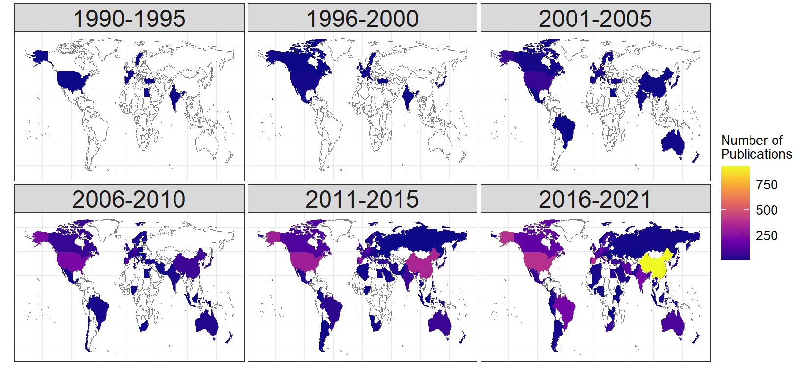

Methods: An Evidence Synthesis of Pharmaceuticals & Personal Care
Products (PPCPs) in the Environment
================
Meyer, Powers, & Hampton
08 September 2021

  - [For the reader](#for-the-reader)
  - [Initial Web of Science (WOS)
    search](#initial-web-of-science-wos-search)
  - [Required packages and session
    info](#required-packages-and-session-info)
  - [Import WOS Records into R](#import-wos-records-into-r)
  - [PPCPs](#ppcps)
      - [Identify abstracts that contain the focal
        terms](#identify-abstracts-that-contain-the-focal-terms)
      - [Iterate through abstracts for focal
        terms](#iterate-through-abstracts-for-focal-terms)
      - [Add the pharmaceutical class
        column](#add-the-pharmaceutical-class-column)
      - [Enumeration by focal term](#enumeration-by-focal-term)
  - [Multiple PPCPs](#multiple-ppcps)
  - [Sewage Treatment Techniques
    (STTs)](#sewage-treatment-techniques-stts)
  - [Ecosystem types](#ecosystem-types)
  - [Mapping PPCP publications over space and
    time](#mapping-ppcp-publications-over-space-and-time)

## For the reader

This document contains supplemental methods to Meyer et al. (2019).

Meyer, M. F., S. M. Powers, and S. E. Hampton. 2019. An Evidence
Synthesis of Pharmaceuticals and Personal Care Products (PPCPs) in the
Environment: Imbalances among Compounds, Sewage Treatment Techniques,
and Ecosystem Types. Environ. Sci. Technol. 53: 12961–12973.
[doi:10.1021/acs.est.9b02966](https://pubs.acs.org/doi/full/10.1021/acs.est.9b02966).

## Initial Web of Science (WOS) search

Within the WOS interface we conducted an initial topic search (TS) on 08
September 2021:

<center>

TS = ("pharmaceutical\*“) AND TS = (”sewage" OR “wastewater”)

</center>

We then used WOS filters to select only environmentally relevant subject
categories, producing 8,703 records. 250 abstracts were randomly
subsampled to verify topical relevance.

Within the scope of this review, environmentally relevant subject
categories included:

  - Environmental sciences
  - Engineering environmental
  - Water resources
  - Biotechnology applied microbiology
  - Engineering chemical
  - Toxicology
  - Chemistry multidisciplinary
  - Marine freshwater biology
  - Agricultural engineering
  - Limnology
  - Green sustainable science technology
  - Multidisciplinary sciences
  - Ecology
  - Biochemistry molecular biology
  - Microbiology
  - Engineering civil
  - Soil science
  - Agriculture multidisciplinary
  - Endocrinology metabolism
  - Zoology
  - Engineering multidisciplinary
  - Biodiversity conservation
  - Oceanography
  - Biology
  - Environmental studies
  - Fisheries
  - Plant sciences
  - Veterinary sciences
  - Physiology

We then downloaded full citations as text files from the WOS interface.
WOS allows downloads of 500 records at a time, so we downloaded 8,703
records in 14 groups, which we recombined in subsequent steps.

## Required packages and session info

This R script starts with loading the necessary R packages:

``` r
library(reshape2)
library(ggplot2)
library(tidyr)
library(dplyr)
library(stringr)
library(maps)
library(ggmap)
library(maptools)
library(rworldmap)
```

  - **version**: R version 3.6.2 (2019-12-12)
  - **os**: Windows 10 x64
  - **system**: x86\_64, mingw32
  - **ui**: RTerm
  - **language**: (EN)
  - **collate**: English\_United States.1252
  - **ctype**: English\_United States.1252
  - **tz**: America/Los\_Angeles
  - **date**: 2021-09-08

<!-- end of list -->

| Package      | On Disk Version | Loaded Version |
| :----------- | :-------------- | :------------- |
| askpass      | 1.1             | NA             |
| assertthat   | 0.2.1           | 0.2.1          |
| bitops       | 1.0-6           | 1.0-6          |
| brio         | 1.1.1           | NA             |
| callr        | 3.5.1           | NA             |
| cli          | 2.3.1           | 2.3.1          |
| colorspace   | 2.0-0           | 2.0-0          |
| cpp11        | 0.2.6           | NA             |
| crayon       | 1.4.1           | 1.4.1          |
| curl         | 4.3             | NA             |
| desc         | 1.2.0           | NA             |
| diffobj      | 0.3.4           | NA             |
| digest       | 0.6.27          | 0.6.27         |
| dotCall64    | 1.0-0           | 1.0-0          |
| dplyr        | 1.0.4           | 1.0.4          |
| ellipsis     | 0.3.1           | 0.3.1          |
| evaluate     | 0.14            | 0.14           |
| fansi        | 0.4.2           | 0.4.2          |
| farver       | 2.0.3           | NA             |
| fields       | 10.3            | 10.3           |
| foreign      | 0.8-72          | 0.8-72         |
| generics     | 0.1.0           | 0.1.0          |
| ggmap        | 3.0.0           | 3.0.0          |
| ggplot2      | 3.3.3           | 3.3.3          |
| glue         | 1.4.2           | 1.4.2          |
| gtable       | 0.3.0           | 0.3.0          |
| httr         | 1.4.1           | 1.4.1          |
| isoband      | 0.2.3           | NA             |
| jpeg         | 0.1-8.1         | 0.1-8.1        |
| jsonlite     | 1.7.2           | NA             |
| labeling     | 0.4.2           | NA             |
| lattice      | 0.20-38         | 0.20-38        |
| lifecycle    | 1.0.0           | 1.0.0          |
| magrittr     | 2.0.1           | 2.0.1          |
| maps         | 3.3.0           | 3.3.0          |
| maptools     | 0.9-9           | 0.9-9          |
| MASS         | 7.3-51.6        | NA             |
| Matrix       | 1.2-18          | NA             |
| mgcv         | 1.8-33          | NA             |
| mime         | 0.9             | NA             |
| munsell      | 0.5.0           | 0.5.0          |
| nlme         | 3.1-152         | NA             |
| openssl      | 1.4.1           | NA             |
| pillar       | 1.5.1           | 1.5.1          |
| pkgbuild     | 1.2.0           | NA             |
| pkgconfig    | 2.0.3           | 2.0.3          |
| pkgload      | 1.1.0           | NA             |
| plyr         | 1.8.6           | 1.8.6          |
| png          | 0.1-7           | 0.1-7          |
| praise       | 1.0.0           | NA             |
| prettyunits  | 1.1.1           | NA             |
| processx     | 3.5.0           | NA             |
| ps           | 1.6.0           | NA             |
| purrr        | 0.3.4           | 0.3.4          |
| R6           | 2.5.0           | 2.5.0          |
| RColorBrewer | 1.1-2           | NA             |
| Rcpp         | 1.0.6           | 1.0.6          |
| rematch2     | 2.1.2           | NA             |
| reshape2     | 1.4.4           | 1.4.4          |
| RgoogleMaps  | 1.4.5.1         | 1.4.5.1        |
| rjson        | 0.2.20          | 0.2.20         |
| rlang        | 0.4.10          | 0.4.10         |
| rprojroot    | 2.0.2           | NA             |
| rstudioapi   | 0.13            | 0.13           |
| rworldmap    | 1.3-6           | 1.3-6          |
| scales       | 1.1.1           | 1.1.1          |
| sp           | 1.3-2           | 1.3-2          |
| spam         | 2.5-1           | 2.5-1          |
| stringi      | 1.4.6           | 1.4.6          |
| stringr      | 1.4.0           | 1.4.0          |
| sys          | 3.3             | NA             |
| testthat     | 3.0.1           | NA             |
| tibble       | 3.1.0           | 3.1.0          |
| tidyr        | 1.1.2           | 1.1.2          |
| tidyselect   | 1.1.0           | 1.1.0          |
| utf8         | 1.2.1           | 1.2.1          |
| vctrs        | 0.3.6           | 0.3.6          |
| viridisLite  | 0.3.0           | 0.3.0          |
| waldo        | 0.2.3           | NA             |
| withr        | 2.4.1           | 2.4.1          |

Table S1: Packages and versions used

## Import WOS Records into R

The text files were imported using `readLines`. Unnecessary header rows
were removed using the command
`as.character(data.frame(savedrecsXX_orig)[-c(1:2),])`. Each of the
`savedrecs` objects are combined into a single object `savedrecs`.

``` r
# Import each text file
savedrecs1_orig <- readLines(con <- file("savedrecs_ppcps_20210908_1to1000.txt"))
savedrecs2_orig <- readLines(con <- file("savedrecs_ppcps_20210908_1001to2000.txt"))
savedrecs3_orig <- readLines(con <- file("savedrecs_ppcps_20210908_2001to3000.txt"))
savedrecs4_orig <- readLines(con <- file("savedrecs_ppcps_20210908_3001to4000.txt"))
savedrecs5_orig <- readLines(con <- file("savedrecs_ppcps_20210908_4001to5000.txt"))
savedrecs6_orig <- readLines(con <- file("savedrecs_ppcps_20210908_5001to6000.txt"))
savedrecs7_orig <- readLines(con <- file("savedrecs_ppcps_20210908_6001to7000.txt"))
savedrecs8_orig <- readLines(con <- file("savedrecs_ppcps_20210908_7001to8000.txt"))
savedrecs9_orig <- readLines(con <- file("savedrecs_ppcps_20210908_8001to8703.txt"))


# Remove the first two rows of each original file
savedrecs1 <- as.character(data.frame(savedrecs1_orig)[-c(1:2),])
savedrecs2 <- as.character(data.frame(savedrecs2_orig)[-c(1:2),])
savedrecs3 <- as.character(data.frame(savedrecs3_orig)[-c(1:2),])
savedrecs4 <- as.character(data.frame(savedrecs4_orig)[-c(1:2),])
savedrecs5 <- as.character(data.frame(savedrecs5_orig)[-c(1:2),])
savedrecs6 <- as.character(data.frame(savedrecs6_orig)[-c(1:2),])
savedrecs7 <- as.character(data.frame(savedrecs7_orig)[-c(1:2),])
savedrecs8 <- as.character(data.frame(savedrecs8_orig)[-c(1:2),])
savedrecs9 <- as.character(data.frame(savedrecs9_orig)[-c(1:2),])


# Combine savedrecs files into one object
savedrecs <- c(savedrecs1,savedrecs2,savedrecs3,savedrecs4,
               savedrecs5,savedrecs6,savedrecs7,savedrecs8,
               savedrecs9)
```

Next, we convert the `savedrecs` object into a dataframe with extracted
information for publication type (PT), authors (AU), abstract (AB),
title (TI), publication name (SO), DOI (DI), publication year (PY),
subject category (SC), and Web of Science category (WC). When
downloading a full citation report, other WOS field tags can be
selected, such as country (C1).

``` r
# Select fields pertaining to the desired WOS tag
# Use general pattern of "*XX *|* XX*" to select multiple fields with a grep statement
which <- grep("*PT *|*AU *|*AB *|*TI *|*SO *|*DI *|*PY *|*SC *|*WC *|*C1 *", savedrecs) 
# Filter savedrecs by the indexed WOS fields in 'which'
savedrecs <- savedrecs[which]     
# Make sure savedrecs is all characters
savedrecs <- as.character(savedrecs) 
# Isolate the savedrecs WOS field
bibtype <- as.character(substr(savedrecs,1,2)) 
# Isolate the descriptions for each of WOS tags
desc <- substr(savedrecs,4,nchar(savedrecs))  
# Build an index for each item
index <- rep(0,length(savedrecs))       
# Create a dataframe of index, WOS tag, and description
df <- data.frame(index,bibtype,desc)       
# Find the index for differing publications
new <- which(df$bibtype=="PT")                       
newindex <- 0
# Now, we build a new index where all indices are for a given pub
for(i in 1:length(df[,1])){                        
  if(i %in% new){newindex <- newindex+1}
  df$index[i] <- newindex
}

# Change bibtype to character, remove rows where bibtype is blank
df$bibtype <- as.character(df$bibtype)
df <- df[which(df$bibtype!="  "),] 

# Pivot the long table format to wide format
df_wide <- dcast(df,index~bibtype)
```

The next section specifies focal terms that were used in our analysis of
WOS abstracts. For the purposes of this study, we were interested in
particular PPCP compounds, sewage treatment techniques, and ecosystem
types. As detailed in the main **Methods**, we used 70 PPCPs identified
in Kolpin et al. (2002) and Focazio et al. (2008). In subsequent steps,
we evaluated presence/absence of the below words and word groups in the
WOS abstracts.

``` r
focal_pharms <- c("azithromycin", "carbodox", "chlortetracycline", "ciprofloxacin", 
                  "demeclocycline", "doxycycline", "enrofloxacin", "ertyhromycin", 
                  "lincomycin","methotrexate", "minocycline", "norfloxacin", 
                  "oxytetracycline", "roxithromycin", "sarafloxacin", 
                  "sulfachloropyridazine", "sulfadimethoxine", "sulfamerazine",
                 "sulfamethazine", "sulfamethizole", "sulfamethoxazole", 
                 "sulfathiazole", "tetracycline", "trimethoprim", "tylosin", 
                 "virginiamycin", "albuterol", "salbutamol", "cimetidine", "codeine", 
                 "dehydronifedipine", "digoxin", "digoxigenin", "diltiazem", 
                 "diphenhydramine", "enalaprilat", "fluoxetine", "gemfibrozil", 
                 "metformin", "paroxetine", "ranitidine", "warfarin",
                 "acetaminophen", "paracetamol", "caffeine", "cotinine", 
                 "1,7-dimethylxanthine", "ibuprofen", "1,4-dichlorobenzene", 
                 "3-methyl-1(H)-indole", "acetyl-hexamethyl-tetrahydro-naphthalene",
                 "hexahydrohexamethyl-cyclopentabenzopyran", "indole","isoborneole",  
                 "isoquinoline", "2,6-di-tert-butylphenol",
                 "2,6-di-tert-butyl-1,4,-benzoquinone", 
                 "3-tert-butyl-4-hydroxy anisole", "butylated hydroxy toluene",
                 "androsterone", "cholesterol", "coprostanol", "equilenin", 
                 "equilin", "estradiol", "estriol", "estrone", "mestranol", 
                 "19-nrethisterone","progesterone", "stigmastanol", "testosterone")

antibiotic <- c("azithromycin", "carbodox", "chlortetracycline", "ciprofloxacin", 
                "demeclocycline", "doxycycline", "enrofloxacin", "ertyhromycin", 
                "lincomycin","methotrexate", "minocycline", "norfloxacin", 
                "oxytetracycline", "roxithromycin","sarafloxacin", 
                "sulfachloropyridazine", "sulfadimethoxine", "sulfamerazine",
                "sulfamethazine", "sulfamethizole", "sulfamethoxazole", 
                "sulfathiazole", "tetracycline", "trimethoprim", "tylosin", 
                "virginiamycin")

prescription_drugs <- c("albuterol", "salbutamol", "cimetidine", "codeine", 
                        "dehydronifedipine", "digoxin", "digoxigenin", "diltiazem", 
                        "diphenhydramine", "enalaprilat", "fluoxetine", "gemfibrozil", 
                        "metformin", "paroxetine", "ranitidine", "warfarin")

nonprescription_drugs <- c("acetaminophen", "paracetamol", "caffeine", 
                           "cotinine", "1,7-dimethylxanthine", "ibuprofen")

fragrance <- c("1,4-dichlorobenzene", "3-methyl-1(H)-indole", 
               "acetyl-hexamethyl-tetrahydro-naphthalene",
               "hexahydrohexamethyl-cyclopentabenzopyran", "indole","isoborneole",  
               "isoquinoline")

antioxidant <- c("2,6-di-tert-butylphenol", 
                 "2,6-di-tert-butyl-1,4,-benzoquinone", 
                 "3-tert-butyl-4-hydroxy anisole", "butylated hydroxy toluene")


hormone <- c("androsterone", "cholesterol", "coprostanol", "equilenin", "equilin", 
             "estradiol", "estriol", "estrone", "mestranol", "19-nrethisterone", 
             "progesterone", "stigmastanol", "testosterone")

system <- c("lake", "groundwater", "river", "ocean", "soil", "estuary", "wetland", 
            "lagoon", "stream", "aquifer", "forest", "pond", "polishing pond", 
            "wastewater stream", "waste stream")


stt <- c("septic", "WTP", "activated sludge", "membrane bioreactor", "nanofiltration", 
         "chlorination", "anammox", "advanced oxidation", "activated carbon",
         "solids", "biosolids", "coagulation", "flocculation", "constructed wetland",
         "sand filtration", "sedimentation", "anaerobic digester", "anaerobic digestion")
```

## PPCPs

### Identify abstracts that contain the focal terms

The remaining sections identify abstracts that contain focal terms and
count them by year and group. Because abstracts may contain multiple
focal terms, the sum of proportions across all focal terms for a year
may sometimes exceed one.

### Iterate through abstracts for focal terms

We use a `for loop` to iterate through each abstract and focal term. The
resulting data frame contains a column `ABcontains` that identifies
presence/absence of a given PPCP.

``` r
# First copy the wide dataframe 
df_pharm <- df_wide
# Create an empty character vector where we will put focal terms
df_pharm$term_pharm <- ""
# Create an empty numeric column to count number of times a term appears
df_pharm$ABcontains <- 0
# Convert Publication Year to a numeric
df_pharm$PY <- as.numeric(df_pharm$PY) 
# Copy this dataframe to a "final dataframe version"
df_pharm_final <- df_pharm
# For loop to iterate through each focal pharm in character vector
for (i in 1:length(focal_pharms)){ 
  # Assign temporary variable for a particular pharm
  termi <- paste("\\b", focal_pharms[i], "\\b", sep = "")  
  # Create a temporary dataframe
  dfi <- df_pharm
  # Search for instances of focal pharm in the abstract
  whichi <- grep(termi, dfi$AB, ignore.case = TRUE)
  # Create a reference to which pharm is present within the abstract
  dfi$term <- focal_pharms[i] 
  # Assign a value of one to abstracts that contain a given pharm
  dfi$ABcontains[whichi] <- 1      
  # Start the final dataframe if this is the first iteration through the for loop
  if(i==1){df_pharm_final <- dfi}       
  # Combine the final dataframe with the temporary after the first for loop iteration
  if(i>1){df_pharm_final <- rbind(df_pharm_final,dfi)} 
}
# Set factor levels for the focal pharms
df_pharm_final$term_pharm <- factor(df_pharm_final$term_pharm, levels = focal_pharms) 

# I added a step that makes sure ABcontains only has a value of 1 or 0.
df_pharm_binary <- df_pharm_final
# In most cases, this step is redundant. It is included as a fail-safe.  
for (i in length(df_pharm_binary$ABcontains)){         
  if(df_pharm_binary$ABcontains[i] != 0){
    df_pharm_binary$ABcontains[i] = 1
  }
}
```

### Add the pharmaceutical class column

We can then build the pharmaceutical class column using serial mutate
and ifelse statements. All of our successive analyses will use the
pharmaceutical classes.

``` r
df_pharm_binary$CLASS <- NULL
df_pharm_binary <- df_pharm_binary %>%
                  mutate(CLASS = ifelse(term %in% antibiotic, "antibiotic", NA),
                         CLASS = ifelse(term %in% prescription_drugs, "prescription drug", 
                                        CLASS),
                         CLASS = ifelse(term %in% nonprescription_drugs, 
                                        "non-prescription drug", CLASS),
                         CLASS = ifelse(term %in% fragrance, "fragrance", CLASS),
                         CLASS = ifelse(term %in% antioxidant, "antioxidant", CLASS),
                         CLASS = ifelse(term %in% hormone, "hormone", CLASS))
```

### Enumeration by focal term

Next, we calculate the number of abstracts in a given year and
pharmaceutical class in two steps.

We need to flag an individual abstract as containing an instance of a
given pharmaceutical class. A given abstract is assigned a value of 1 if
it mentions a pharmaceutical class.

``` r
df_pharm_wo_na_part1 <- df_pharm_binary %>%
  # Filter for studies after 1990
  filter(PY >= 1990) %>%
  # Group by abstract Year, then Title, then Pharmaceutical Class
  group_by(PY, TI, CLASS) %>%
  # Sum the number of times a class was referenced per abstract
  summarize(TOTAL = sum(ABcontains)) %>%
  # If greater than one, replace with one, so we have a presence/absence
  mutate(TOTAL = ifelse(TOTAL > 1, 1, TOTAL))     
```

We sum the number of distinct abstracts that mention a given
pharmaceutical class in a given year.

``` r
df_pharm_wo_na_part2 <- df_pharm_wo_na_part1 %>%
  # Select studies that have at least one PPCP referenced
  filter(TOTAL == 1) %>%  
  # Group by abstract, year, and pharmaceutical class
  group_by(PY, CLASS) %>%                
  # Count the number of titles that reference a given pharmaceutial class
  summarize(COUNT_PUBS = n_distinct(TI)) %>%
  # Filter for pubs after 1990
  filter(PY >= 1990) %>%
  spread(CLASS, COUNT_PUBS) %>%
  # Replace NA values with 0
  replace_na(list(antibiotic = 0,
                  fragrance = 0,
                  hormone = 0,
                  `nonprescription drug` = 0,
                  `prescription drug` = 0)) %>%
  gather(CLASS, COUNT_PUBS, antibiotic:`prescription drug`)
```

We then calculate the number of abstracts that mentioned a particular
pharmaceutical class in the abstract. This count excludes studies that
did not contain any pharmaceutical class names in the abstract. For this
reason, we only consider studies that mention a specific PPCP in the
abstract.

``` r
DI_count_total <- df_pharm_wo_na_part1 %>%
  # Select all studies that reference at least one pharmaceutical class
  filter(TOTAL == 1) %>%
  # Group by year
  group_by(PY) %>%    
  # Sum the number of titles in a given year
  summarize(TOTAL_TI = n_distinct(TI)) %>%
  # Filter for all papers pulished after 1990
  filter(PY >= 1990)                              
```

Finally, we take the proportion of the total number of abstracts
mentioning a particular PPCP in a given year normalized by the total
number of abstracts mentioning at least one type of PPCP in a year.

``` r
dataplot_pharm <- full_join(df_pharm_wo_na_part2, DI_count_total) %>%
  ungroup() %>%
  add_row(PY = 1997:2021, CLASS = "antioxidant", COUNT_PUBS = 0, TOTAL_TI = 0) %>%
  # Group by abstract year and pharmaceutical class
  group_by(PY, CLASS) %>%                      
  # Calculate proportions for analysis
 mutate(PROP_COUNT = COUNT_PUBS/TOTAL_TI,
        PROP_COUNT = ifelse(is.nan(PROP_COUNT), 0, PROP_COUNT)) %>%
  as.data.frame()
```

We can then produce a plot of proportions over time and by pharmceutical
class.

|         | antibiotic | antioxidant | fragrance |   hormone | non-prescription drug | prescription drug |
| ------- | ---------: | ----------: | --------: | --------: | --------------------: | ----------------: |
| Min.    |  0.0000000 |           0 | 0.0000000 | 0.0000000 |             0.3333333 |         0.0000000 |
| 1st Qu. |  0.3750000 |           0 | 0.0000000 | 0.0986395 |             0.4285714 |         0.1540616 |
| Median  |  0.4545455 |           0 | 0.0000000 | 0.1710526 |             0.4655172 |         0.1904762 |
| Mean    |  0.4082393 |           0 | 0.0030790 | 0.1748451 |             0.5013861 |         0.1778043 |
| 3rd Qu. |  0.5072993 |           0 | 0.0045455 | 0.2077922 |             0.5200000 |         0.2335766 |
| Max.    |  0.6666667 |           0 | 0.0188679 | 0.5000000 |             1.0000000 |         0.3400000 |

Table S2: Summary statistics by PPCP

``` r
# The lines below build the final plot
dataplot_pharm$CLASS <- factor(dataplot_pharm$CLASS, 
                               levels = c("non-prescription drug", "antibiotic",  
                                          "hormone", "prescription drug",  
                                          "fragrance", "antioxidant"))

yearplot_pharm_total <-  ggplot(dataplot_pharm, 
                                aes(x = as.numeric(PY), y = PROP_COUNT, 
                                    group = CLASS)) +
  geom_point(aes(fill = COUNT_PUBS), size = 6, pch=21, color = "black") +
  scale_fill_viridis_c(option = "plasma", 
                       name = "Number of \nPublications") +
  ylab("Proportion of Abstracts") + 
  xlab("Publication Year")+
  theme_minimal()+
  facet_wrap(~CLASS, drop = FALSE) +
  theme(legend.position="right")+
  theme(plot.title = element_text(size=20),
        strip.text.x = element_text(size=20),
        strip.background = element_rect(fill = "white"),
        panel.background = element_rect(fill ="white"),
        axis.title = element_text(size = 20),
        axis.text.x = element_text(size = 20),
        axis.text.y = element_text(size = 20),
        legend.text = element_text(size = 20),
        legend.title = element_text(size = 20),
        legend.key.height = unit(1, "in"),
        axis.title.y=element_text(margin=margin(0,20,0,0)), 
        axis.title.x=element_text(margin=margin(20,0,0,0)),
        plot.margin = margin(20, 20, 20, 20))
yearplot_pharm_total
```



``` r
ggsave(filename = "ppcp_timeseries.png", plot = yearplot_pharm_total, device = "png", 
       height = 8, width = 14, units = "in")
```

## Multiple PPCPs

This next section tabulates how many PPCPs are included in each study.
The structure is similar to that of the above code with the exception
that we add the number of PPCP usage classes for a given study and year.

``` r
richness_orig <- df_pharm_binary %>%
  # Filter for studies published after 1990
  filter(PY >= 1990) %>% 
  # Group by abstract year, then title, then pharmaceutical class
  group_by(PY, TI, CLASS) %>%   
  # Sum the number of pharmceuticals for a given pharmaceutical class
  summarize(TOTAL = sum(ABcontains)) %>%  
  # Replace summed values with a 1 so we have presence/absence data of the pharm class
  mutate(TOTAL = ifelse(TOTAL > 1, 1, TOTAL)) %>% 
  # Filter for studies that mention at least pharmaceutical class
  filter(TOTAL >= 1) %>%    
  # Remove grouping
  ungroup() %>%             
  # Group by abstract year and title
  group_by(PY, TI) %>%    
  # Sum the number of pharmaceutical classes for a given abstract
  summarize(RICHNESS = sum(TOTAL)) %>%    
  # Remove grouping
  ungroup() %>%     
  # Group by abstract year and RICHNESS
  group_by(PY, RICHNESS) %>%      
  # Sum the number of unique titles
  mutate(UNIQUE_TI = n_distinct(TI))              

ppcp_div <- ggplot(richness_orig, aes(as.factor(PY), as.factor(RICHNESS), 
                                      size = UNIQUE_TI)) +
  geom_point(shape = 21, colour = "grey40",  
             fill = "grey80", stroke = 2) +
  scale_size("Number of Publications", 
             range = c(10,35), 
             breaks = c(25, 50, 75, 100, 125, 150, 175, 200)) +
  geom_text(aes(label = UNIQUE_TI), size = 6,color = "black") +
  ylab("Number of Pharmaceutical Usage Classes in an Abstract") +
  xlab("Publication Year") +
  theme_minimal() +
  theme(legend.position = "none",
        panel.grid.major = element_blank(), 
        panel.grid.minor = element_blank(),
        panel.background = element_rect(color = "black", size =1),
        plot.title = element_text(size=20),
        strip.text.x = element_text(size=20),
        axis.title = element_text(size = 20),
        axis.text.x = element_text(size = 20, angle = 45, vjust = 0.5),
        axis.text.y = element_text(size = 20),
        axis.title.y=element_text(margin=margin(0,20,0,0)), 
        axis.title.x=element_text(margin=margin(20,0,0,0)),
        plot.margin = margin(20, 20, 20, 20))
ppcp_div
```



``` r
ggsave(filename = "mixture_timeseries.png", plot = ppcp_div, device = "png", 
       height = 10, width = 18, units = "in")
```

## Sewage Treatment Techniques (STTs)

This section is similar to the one above, where we searched for
individual compounds. Instead of using the `focal_pharms` character
vector, we use the `stt` character vector.

Lines that are different from the previous code are commented
explicitly.

``` r
df_stt <- df_wide 
df_stt$stt <- ""
df_stt$ABcontains <- 0
df_stt$PY <- as.numeric(df_stt$PY)
df_stt_final <- df_stt
for (i in 1:length(stt)){                
  termi<-stt[i]  
  # Note this line contains a different focal term vector than the previous script
  dfi <- df_stt
  whichi <- grep(termi, dfi$AB, ignore.case = TRUE) 
  dfi$term <- termi  
  dfi$ABcontains[whichi] <- 1
  if(i==1){df_stt_final <- dfi}
  if(i>1){df_stt_final <- rbind(df_stt_final,dfi)}
}
# STT factor levels defined 
df_stt_final$term <- factor(df_stt_final$term, levels = stt) 

df_stt_binary <- df_stt_final
for (i in length(df_stt_binary$ABcontains)){
  if(df_stt_binary$ABcontains[i] != 0){
    df_stt_binary$ABcontains[i] = 1
  }
}

df_stt_wo_na_part1 <- df_stt_binary %>%
  mutate(term = as.character(term), 
         term = ifelse(term == "biosolids", "solids", term),
         term = ifelse(term == "anaerobic digestion", "anaerobic digester", term),
         term = as.factor(term)) %>%
  filter(PY >= 1990) %>%
  group_by(PY, TI, term) %>%
  summarize(TOTAL = sum(ABcontains)) %>%
  mutate(TOTAL = ifelse(TOTAL > 1, 1, TOTAL))

df_stt_wo_na_part2 <- df_stt_wo_na_part1 %>%
  filter(TOTAL == 1) %>%
  group_by(PY, term) %>%
  summarize(COUNT_PUBS = n_distinct(TI)) %>%
  filter(PY >= 1990) %>%
  spread(term, COUNT_PUBS) %>%
  replace_na(list(septic = 0,
                  WTP = 0,
                  `activated sludge` = 0,
                  `membrane bioreactor` = 0,
                  nanofiltration = 0,
                  chlorination = 0,
                  anammox = 0,
                  `advanced oxidation` = 0,
                  `activated carbon` = 0,
                  coagulation = 0, 
                  `constructed wetland` = 0,
                  sedimentation = 0,
                  solids = 0,
                  `sand filtration` = 0,
                  flocculation = 0,
                  `anaerobic digester` = 0)) %>%
  gather(term, COUNT_PUBS, `activated carbon`:WTP)

DI_count_total <- df_stt_wo_na_part1 %>%
  filter(TOTAL == 1) %>%
  group_by(PY) %>%
  summarize(TOTAL_TI = n_distinct(TI)) %>%
  filter(PY >= 1990)

dataplot_stt <- full_join(df_stt_wo_na_part2, DI_count_total) %>%
  group_by(PY, term) %>%
  mutate(PROP_COUNT = COUNT_PUBS/TOTAL_TI,
        PROP_COUNT = ifelse(is.nan(PROP_COUNT), 0, PROP_COUNT)) %>%
  as.data.frame()
```

|         | activated carbon | activated sludge | advanced oxidation | anaerobic digester |   anammox | chlorination | coagulation | constructed wetland | flocculation | membrane bioreactor | nanofiltration | sand filtration | sedimentation |    septic |    solids |       WTP |
| ------- | ---------------: | ---------------: | -----------------: | -----------------: | --------: | -----------: | ----------: | ------------------: | -----------: | ------------------: | -------------: | --------------: | ------------: | --------: | --------: | --------: |
| Min.    |        0.0000000 |        0.0000000 |          0.0000000 |          0.0000000 | 0.0000000 |    0.0000000 |   0.0000000 |           0.0000000 |    0.0000000 |           0.0000000 |      0.0000000 |       0.0000000 |     0.0000000 | 0.0000000 | 0.0000000 | 0.0000000 |
| 1st Qu. |        0.0305344 |        0.1666667 |          0.0217391 |          0.0000000 | 0.0000000 |    0.0000000 |   0.0000000 |           0.0000000 |    0.0000000 |           0.0000000 |      0.0000000 |       0.0000000 |     0.0000000 | 0.0000000 | 0.1057269 | 0.2608696 |
| Median  |        0.1111111 |        0.2363636 |          0.0851064 |          0.0268456 | 0.0000000 |    0.0305344 |   0.0381679 |           0.0377358 |    0.0093897 |           0.0871935 |      0.0425532 |       0.0000000 |     0.0106383 | 0.0093168 | 0.1509434 | 0.3333333 |
| Mean    |        0.1288312 |        0.3503772 |          0.0870360 |          0.0244865 | 0.0027594 |    0.0275379 |   0.0405429 |           0.0333183 |    0.0197355 |           0.0741882 |      0.0489418 |       0.0092991 |     0.0290664 | 0.0179849 | 0.1826452 | 0.2759766 |
| 3rd Qu. |        0.1492537 |        0.5000000 |          0.1320755 |          0.0410448 | 0.0046948 |    0.0435967 |   0.0516605 |           0.0604027 |    0.0186567 |           0.1145038 |      0.0660793 |       0.0111940 |     0.0291971 | 0.0270270 | 0.2000000 | 0.3695652 |
| Max.    |        0.6666667 |        1.0000000 |          0.2500000 |          0.0701754 | 0.0145985 |    0.1132075 |   0.2500000 |           0.0875912 |    0.2500000 |           0.2000000 |      0.2000000 |       0.0526316 |     0.2500000 | 0.0638298 | 0.6666667 | 0.6000000 |

Table S3: Summary statistics by STT

``` r
dataplot_stt$term <- factor(dataplot_stt$term, 
                            levels = c("activated sludge", "WTP", "solids",
                                       "activated carbon", "advanced oxidation", 
                                       "membrane bioreactor", "nanofiltration", "coagulation",
                                       "sedimentation", "anaerobic digester", "chlorination",  
                                       "constructed wetland", "flocculation", "septic", 
                                       "sand filtration", "anammox"))

# Michael created this re-arrangement for the ESA INSPIRE presentation
# dataplot_stt$term <- factor(dataplot_stt$term, 
#                             levels = c("activated sludge", "WTP", "solids",
#                                        "activated carbon", "advanced oxidation", 
#                                        "membrane bioreactor", "nanofiltration", "coagulation",
#                                        "sedimentation", "anaerobic digester", "chlorination",  
#                                         "flocculation", "anammox", "constructed wetland",
#                                        "septic", "sand filtration"))

yearplot_stt_total <-  ggplot(dataplot_stt, 
                              aes(x = as.numeric(PY), y = PROP_COUNT, 
                                  group = term)) +
  geom_point(aes(fill = COUNT_PUBS), size = 6, pch=21, color = "black") +
  scale_fill_viridis_c(option = "plasma", 
                       name = "Number of \nPublications") +
  ylab("Proportion of Abstracts") + 
  xlab("Publication Year")+
  theme_minimal()+
  facet_wrap(~term, drop = FALSE) +
  theme(legend.position="right")+
  theme(plot.title = element_text(size=20),
        strip.text.x = element_text(size=20),
        strip.background = element_rect(fill = "white"),
        panel.background = element_rect(fill ="white"),
        axis.title = element_text(size = 20),
        axis.text.x = element_text(size = 20),
        axis.text.y = element_text(size = 20),
        legend.text = element_text(size = 20),
        legend.title = element_text(size = 20),
        legend.key.height = unit(1, "in"),
        axis.title.y=element_text(margin=margin(0,20,0,0)), 
        axis.title.x=element_text(margin=margin(20,0,0,0)),
        plot.margin = margin(20, 20, 20, 20))
yearplot_stt_total
```



``` r
ggsave(filename = "stt_timeseries.png", plot = yearplot_stt_total, device = "png", 
       height = 12, width = 18, units = "in")
```

## Ecosystem types

Because this section did not have a review to provide focal terms, we
tabulated word frequencies for all 7,383 abstracts and manually
identified ecosystem terms with greater than 100 instances.

``` r
# Script for word frequency enumeration
library(stringr)
library(tm) 

# First create text_in with only the abstracts
text_in <- df_wide$AB

# Remove NAs
text_in <- text_in[which(is.na(text_in)==FALSE)]

# For these procedures, object needs to be of class Corpus
text0 <- Corpus(x = VectorSource(x = text_in))

# Various text processing steps. 
text <-  TermDocumentMatrix(text0, 
                           control = 
                             list(removePunctuation = TRUE,
                                  stopwords = TRUE,
                                  tolower = TRUE,
                                  stemming = FALSE,
                                  removeNumbers = TRUE,
                                  bounds = list(global = c(1, Inf)))) 


# Find the frequency of certain terms that appear at least 
# 20 times, and then sort them in decreasing order. 
# The final outputted matrix will be saved as a CSV. 
ft <- findFreqTerms(text, lowfreq = 15, highfreq = Inf)
ft_matrix <- as.matrix(text[ft,]) 
sorted_matrix <- sort(apply(ft_matrix, 1, sum), decreasing = TRUE)

write.csv(sorted_matrix, "wf_output_table_20200717.csv")
```

The following section is similar to previous sections, where we searched
for individual compounds. Instead of using the `focal_pharms` character
vector, we use the `systems` character vector.

Lines that are different from the previous code are commented
explicitly.

``` r
df_system <- df_wide 
df_system$system <- ""
df_system$ABcontains <- 0
df_system$PY <- as.numeric(df_system$PY)
df_system_final <- df_system
for (i in 1:length(system)){
  termi <- system[i]
  # Note this line contains a different focal term vector than previous scripts
  dfi <- df_system
  whichi <- grep(paste("\\b",termi, sep = ""),dfi$AB, ignore.case = TRUE)
  dfi$term <- termi  
  dfi$ABcontains[whichi] <- 1
  if(i==1){df_system_final <- dfi}
  if(i>1){df_system_final <- rbind(df_system_final,dfi)}
}
# Ecosystem type factor levels defined
df_system_final$system <- factor(df_system_final$system, levels = system)

df_system_binary <- df_system_final
for (i in length(df_system_binary$ABcontains)){
  if(df_system_binary$ABcontains[i] != 0){
    df_system_binary$ABcontains[i] = 1
  }
}

df_system_wo_na_part1 <- df_system_binary %>%
  filter(PY >= 1990) %>%
  group_by(PY, TI, term) %>%
  summarize(TOTAL = sum(ABcontains)) %>%
  mutate(TOTAL = ifelse(TOTAL > 1, 1, TOTAL)) %>%
  mutate(term = ifelse(term == "polishing pond", "polishing.pond", term), 
         term = ifelse(term == "wastewater stream", "wastewater.stream", term),
         term = ifelse(term == "waste stream", "waste.stream", term)) %>%
  spread(term, TOTAL) %>%
  filter(polishing.pond != 1 & waste.stream != 1 & wastewater.stream != 1) %>%
  gather(term, TOTAL, -PY, - TI)

df_system_wo_na_part2 <- df_system_wo_na_part1 %>%
  filter(TOTAL == 1) %>%
  group_by(PY, term) %>%
  summarize(COUNT_PUBS = n_distinct(TI)) %>%
  filter(PY >= 1990) %>%
  spread(term, COUNT_PUBS) %>%
  replace_na(list(river = 0,
                  pond = 0,
                  soil = 0,
                  stream = 0,
                  aquifer = 0,
                  groundwater = 0,
                  lake = 0,
                  wetland = 0,
                  lagoon = 0,
                  ocean = 0,
                  estuary = 0,
                  forest = 0)) %>%
  gather(term, COUNT_PUBS, aquifer:wetland)

DI_count_total <- df_system_wo_na_part1 %>%
  filter(TOTAL == 1) %>%
  group_by(PY) %>%
  summarize(TOTAL_TI = n_distinct(TI)) %>%
  filter(PY >= 1990)

dataplot_system <- full_join(df_system_wo_na_part2, DI_count_total) %>% 
 group_by(PY, term) %>%
 mutate(PROP_COUNT = COUNT_PUBS/TOTAL_TI,
        PROP_COUNT = ifelse(is.nan(PROP_COUNT), 0, PROP_COUNT)) %>%
 ungroup()
```

|         |   aquifer |   estuary |    forest | groundwater |    lagoon |      lake |     ocean |      pond |     river |      soil |    stream |   wetland |
| ------- | --------: | --------: | --------: | ----------: | --------: | --------: | --------: | --------: | --------: | --------: | --------: | --------: |
| Min.    | 0.0000000 | 0.0000000 | 0.0000000 |   0.0000000 | 0.0000000 | 0.0000000 | 0.0000000 | 0.0000000 | 0.0000000 | 0.0000000 | 0.0000000 | 0.0000000 |
| 1st Qu. | 0.0000000 | 0.0000000 | 0.0000000 |   0.1223576 | 0.0000000 | 0.0616279 | 0.0000000 | 0.0000000 | 0.3949312 | 0.1774351 | 0.1226960 | 0.0000000 |
| Median  | 0.0529408 | 0.0036496 | 0.0000000 |   0.1574227 | 0.0157381 | 0.0865092 | 0.0059524 | 0.0168885 | 0.4543831 | 0.2254507 | 0.1592848 | 0.0622235 |
| Mean    | 0.1027144 | 0.0118486 | 0.0042536 |   0.1762611 | 0.0210800 | 0.1222802 | 0.0094773 | 0.0371457 | 0.4507449 | 0.2029334 | 0.1718347 | 0.0573609 |
| 3rd Qu. | 0.0795901 | 0.0198844 | 0.0075842 |   0.2010949 | 0.0282696 | 0.1307847 | 0.0171425 | 0.0380048 | 0.5075347 | 0.2637401 | 0.1818182 | 0.0967450 |
| Max.    | 1.0000000 | 0.0523810 | 0.0224215 |   0.5000000 | 0.1627907 | 1.0000000 | 0.0437956 | 0.5000000 | 1.0000000 | 0.5000000 | 1.0000000 | 0.1386139 |

Table S4: Summary statistics by ecosystem type

``` r
dataplot_system$term <- factor(dataplot_system$term, 
                               levels = c("river", "soil", "groundwater", 
                                          "stream", "lake", "aquifer", "wetland", 
                                          "pond", "lagoon", "ocean", "estuary", 
                                          "forest"))

dataplot_system$term <- factor(dataplot_system$term, 
                               levels = c("river", "stream", "soil", "groundwater", 
                                          "aquifer", "lake", "wetland", 
                                          "pond", "lagoon", "ocean", "estuary", 
                                          "forest"))

yearplot_system_total <-  ggplot(dataplot_system, aes(x = as.numeric(PY), y=PROP_COUNT)) +
  geom_point(aes(fill = COUNT_PUBS), size = 6, pch=21, color = "black") +
  scale_fill_viridis_c(option = "plasma", 
                       name = "Number of \nPublications") +
  ylab("Proportion of Abstracts") + 
  xlab("Publication Year")+
  theme_minimal()+
  facet_wrap(~term, drop = FALSE) +
  theme(legend.position="right")+
  theme(plot.title = element_text(size=20),
        strip.text.x = element_text(size=20),
        strip.background = element_rect(fill = "white" ),
        panel.background = element_rect(fill ="white"),
        axis.title = element_text(size = 20),
        axis.text.x = element_text(size = 20),
        axis.text.y = element_text(size = 20),
        legend.text = element_text(size = 20),
        legend.title = element_text(size = 20),
        legend.key.height = unit(1, "in"),
        axis.title.y=element_text(margin=margin(0,20,0,0)), 
        axis.title.x=element_text(margin=margin(20,0,0,0)),
        plot.margin = margin(20, 20, 20, 20))
yearplot_system_total
```



``` r
ggsave(filename = "system_timeseries.png", plot = yearplot_system_total, device = "png", 
       height = 10, width = 16, units = "in")
```

## Mapping PPCP publications over space and time

In addition to searching within the abstract itself, the techniques
described within this document can be used to create maps that display
where and when PPCP publications may originate based on the first
author’s associated country.

``` r
# First get the base map of the world
wrld <- getMap("coarse")

# Convert the world map into a dataframe
wrld <- fortify(wrld)
# Remove Antarctica 
wrld <- subset(wrld, id != "Antarctica") 
# Convert all country names to upper case
wrld$id <- toupper(wrld$id)

count_pubs_df <- df_wide %>%
  # Keep just the abstract's idex, publication year, primary author information and DOI
  select(index, PY, C1, DI) %>%
  # We then need to isolate the country each author's address
  # The first step of the process is to remove a period at the end of the address
  mutate(country = sub(".*,", "", C1), 
         # Remove white spaces
         country = trimws(country, which = "both"),
         # Extract the complete last word of the country name
         country = str_sub(country, -nchar(country), -2),
         # The following steps are general cleaning procedures to standardize 
         # country names
         # Standard country names are based off the world map selected
         country = ifelse(grepl("USA", country), 
                          "United States of America", country),
         country = ifelse(grepl("VA 24060", country), 
                          "United States of America", country),
         country = ifelse(grepl("Scotland", country), 
                          "United Kingdom", country),
         country = ifelse(grepl("England", country), 
                          "United Kingdom", country),
         country = ifelse(grepl("Peoples R China", country), 
                          "China", country),
         country = ifelse(grepl("Serbia", country), 
                          "Republic of Serbia", country),
         country = ifelse(grepl("ARAB EMIRATES", country), 
                          "UNITED ARAB EMIRATES", country),
         # Convert all country names to upper case to match world map
         country = toupper(as.factor(country)),
         id = toupper(country)) %>%
  # Next we create a grouping factor for five year time intervals
  mutate(year_group = ifelse(PY %in% as.character(c(1990:1995)), 
                             "1990-1995", NA),
         year_group = ifelse(PY %in% as.character(c(1996:2000)), 
                             "1996-2000", year_group),
         year_group = ifelse(PY %in% as.character(c(2001:2005)), 
                             "2001-2005", year_group),
         year_group = ifelse(PY %in% as.character(c(2006:2010)), 
                             "2006-2010", year_group),
         year_group = ifelse(PY %in% as.character(c(2011:2015)), 
                             "2011-2015", year_group),
         year_group = ifelse(PY %in% as.character(c(2016:2021)), 
                             "2016-2021", year_group)) %>%
  group_by(year_group, country) %>%
  # Sum unique DOIs for each year_group and country combination
  summarize(TOTAL_PUBS = n_distinct(DI)) %>%
  # Remove any NAs that may have arisen in the event a WOS record 
  # does not have an associated country
  na.omit()

# The code below builds the final plot

world_plot <- ggplot() + 
  geom_map(data = wrld, map = wrld, aes(x = long, y = lat, map_id = id), 
           fill="white", color="#7f7f7f") +
  geom_map(data = count_pubs_df,
           map=wrld, aes(map_id = country, fill = TOTAL_PUBS)) +
  scale_fill_viridis_c(option = "plasma", 
                       name = "Number of \nPublications",
                       guide = guide_colorbar(barwidth = 3,
                                              barheight = 10)) +
 
  facet_wrap(~ year_group) +
  xlab("") +
  ylab("") +
  theme_bw() +
  theme(axis.text.x = element_blank(),
        axis.text.y = element_blank(),
        strip.text.x = element_text(size = 36),
        legend.text = element_text(size = 20),
        legend.title = element_text(size = 20),
        legend.position = "right",
        axis.ticks = element_blank())
world_plot
```



``` r
ggsave(filename = "world_plot.png", plot = world_plot, device = "png", 
       height = 10, width = 20, units = "in")
```
